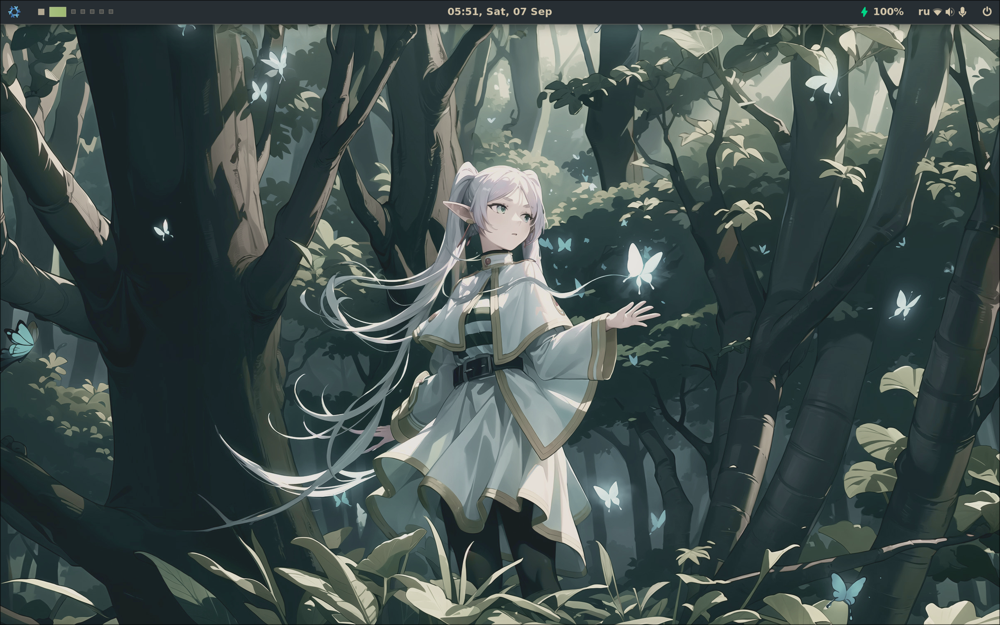

## Modules

The config is modular, you can either specify settings inside [`flake.nix`](https://github.com/Serpentian/AlfheimOS/blob/master/flake.nix) or/and
exclude/include some modules inside profiles directory with:

```nix
imports = [
    ./import1.nix
    ./import2.nix
    ...
];
```

## Profiles

The configuration is separated into several profiles:
* Personal - personal laptop/desktop
* Work - work laptop (included in the Personal profile, as I work from home)

Each profile contains a `configuration.nix` for system-level configuration and a
`home.nix` for user-level configuration. Setting the `profile` variable in
[`flake.nix`](https://github.com/Serpentian/AlfheimOS/blob/master/flake.nix) automatically sources the correct `configuration.nix` and `home.nix`.

## Install

I suppose, you already installed NixOS. To get this config running, start by
cloning the repo:

```
git clone https://github.com/Serpentian/AlfheimOS.git ~/.dotfiles
```

To get the hardware configuration on a new system, either copy from
`/etc/nixos/hardware-configuration.nix` or run:

```
cd ~/.dotfiles
sudo nixos-generate-config --show-hardware-config > profiles/desktop/hardware-configuration.nix
```

Don't use my hardware configuration, your system won't boot!

Now, it's time to configure `settings.nix` (and probably profiles) to your liking.
Once the variables are set, then switch into the system configuration by running:

```
cd ~/.dotfiles
sudo nixos-rebuild switch --flake .
```

Home manager can be installed with:

```
nix-channel --add https://github.com/nix-community/home-manager/archive/master.tar.gz home-manager
nix-channel --update
nix-shell '<home-manager>' -A install
```

If home-manager starts to not cooperate, it may be because the unstable branch
of nixpkgs is in the Nix channel list. This can be fixed via:

```
nix-channel --add https://nixos.org/channels/nixpkgs-unstable
nix-channel --update
```

Home-manager may also not work without re-logging back in after it has been
installed. Once home-manager is running, the home-manager configuration can be
installed with:

```
cd ~/.dotfiles
home-manager switch --flake .
```

## Themes




## Credits
* [librephoenix/nixos-config](https://github.com/librephoenix/nixos-config?tab=readme-ov-file) - The repo structure is heavily inspired by this repo.
  Also, check out his [NixOS videos](https://piped.video/channel/UCeZyoDTk0J-UPhd7MUktexw), fantastic entry point to NixOS.
