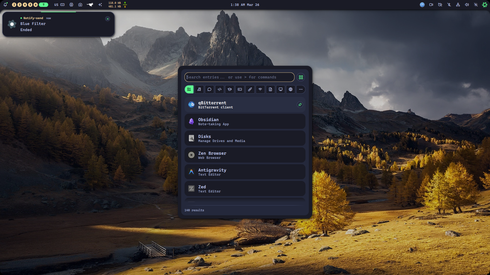

# 🚀 Nixxin

<div align="center">

**NixOS** Enhancement Configurations

[](https://github.com/SoftEng-Islam/nixxin/stargazers)
[](https://github.com/SoftEng-Islam/nixxin/network/members)
[](https://github.com/SoftEng-Islam/nixxin/issues)
[](https://opensource.org/licenses/MIT)
[](https://nixos.org/)

> [!NOTE]
>
> 🎉 **This project is now ready for use by others!** See the [Setup Guide](./SETUP.md) for installation instructions.

A modular, feature-rich NixOS configuration that's easy to customize for different users and hardware setups. Perfect for both beginners and advanced users!

[**🚀 Quick Start**](#-quick-start) • [**📚 Documentation**](#-documentation) • [**✨ Features**](#-features) • [**🏗️ Module Structure**](#️-module-structure) • [**🤝 Contributing**](#-contributing)

</div>

## 🚀 Quick Start

### 🎮 **Try the Demo First!**

Want to see what Nixxin can do without installing?

```bash
curl -sSL https://raw.githubusercontent.com/SoftEng-Islam/nixxin/main/demo.sh | bash
```

### ⚡ **5-Minute Installation**

1. **Clone the repo:**

   ```bash
   git clone https://github.com/SoftEng-Islam/nixxin.git ~/.config/nixxin
   cd ~/.config/nixxin
   ```

2. **Run the setup script:**

   ```bash
   ./setup.sh
   ```

3. **Apply configuration:**

   ```bash
   sudo nixos-rebuild switch --flake .#YOUR_HOSTNAME
   ```

   🎉 **That's it! Your system is now configured!**

## 📚 Documentation

### 📖 **Comprehensive Documentation Site**

[**📚 Browse Full Documentation**](./documentation/) - Complete documentation with MkDocs

### 🚀 **Quick Links**

- [**Installation Guide**](./documentation/docs/getting-started/installation.md) - Step-by-step setup instructions
- [**Module Overview**](./documentation/docs/modules/overview.md) - All available modules and features
- [**Hardware Support**](./documentation/docs/configuration/hardware.md) - CPU, GPU, and peripheral configuration
- [**Troubleshooting**](./documentation/docs/advanced/troubleshooting.md) - Common issues and solutions
- [**Examples**](./documentation/docs/examples/basic-setup.md) - Ready-to-use configurations

### 📋 **Documentation Sections**

- **Getting Started** - Installation, quick start, basic configuration
- **Modules** - Desktop, development, gaming, media, security, AI tools
- **Configuration** - Hardware support, user management, networking, themes
- **Advanced** - Custom modules, flake management, performance optimization
- **Examples** - Basic setup, development machine, gaming rig, server config
- **Contributing** - Guidelines, module development, documentation

## ✨ Features

### 🎯 **Why Choose Nixxin?**

- **🔧 Modular Design** - Enable/disable modules as needed with simple boolean flags
- **💻 Hardware Agnostic** - Works with Intel, AMD, and NVIDIA systems out of the box
- **⚡ Easy Customization** - Simple configuration options for beginners and experts
- **📦 Pre-configured Modules** - Development, gaming, office, media, and more
- **🏠 Home Manager Integration** - Seamless user-level configuration management
- **🚀 One-Click Setup** - Automated setup script gets you running in minutes
- **🎨 Beautiful Themes** - Pre-configured GTK, QT, and terminal themes
- **🔒 Security Focused** - Hardened configurations and best practices

### 🎮 **What's Included?**

| Category | Modules | Description |
|----------|---------|-------------|
| **🖥️ Desktop** | Hyprland, GNOME tools | Modern desktop environments |
| **🌐 Browsers** | Firefox, Chrome, Brave | All major web browsers |
| **💻 Development** | VSCode, Helix, Emacs | Complete development setup |
| **🎮 Gaming** | Steam, Lutris, Wine | Gaming platforms and tools |
| **📊 Office** | LibreOffice, Obsidian | Productivity applications |
| **🎵 Media** | MPV, VLC, Kdenlive | Audio/video software |
| **🔧 System** | Zsh, Git, Networking | Essential system tools |
| **🛡️ Security** | Firewall, Hardening | Security configurations |
| **🤖 AI** | Ollama, AI tools | Artificial intelligence tools |
| **📱 Mobile** | Android development | Mobile development tools |

### 🏆 **Why Nixxin Stands Out**

| Feature | Traditional Setup | Nixxin |
|---------|------------------|--------|
| **Setup Time** | Hours of manual config | 5 minutes with script |
| **Hardware Support** | Manual driver configuration | Automatic detection |
| **Module Management** | Complex package management | Simple boolean flags |
| **Theme Support** | Manual theme setup | Pre-configured themes |
| **Documentation** | Scattered resources | Comprehensive guides |
| **Community Support** | Limited | Active community |
| **Updates** | Manual maintenance | Flake-based updates |

## 🏗️ Module Structure

```
modules/
├── development/     # Development tools and environments
├── desktop/         # Desktop environment and window managers
├── browsers/       # Web browsers
├── media/          # Audio/video applications
├── gaming/         # Gaming platforms and tools
├── office/         # Office applications
├── system/         # System-level configuration
├── networking/     # Network configuration
├── security/       # Security settings
└── ...             # And many more!
```

## 🤝 Contributing

We welcome contributions of all kinds! 🎉

### 🚀 **Quick Ways to Contribute**

1. **⭐ Star the repository** - Helps others discover Nixxin
2. **🐛 Report issues** - Found a bug? Let us know!
3. **💡 Suggest features** - Have an idea? We'd love to hear it!
4. **📝 Improve documentation** - Help make docs better
5. **🔧 Submit pull requests** - Fix bugs or add features

### 🎯 **Areas Needing Help**

- **📚 Documentation** - Improve guides and tutorials
- **🐛 Bug fixes** - Help squash those bugs
- **🎨 Themes** - Create beautiful new themes
- **📦 Modules** - Add new functionality
- **🧪 Testing** - Test on different hardware

### 📖 **Getting Started**

Check out our [Contributing Guide](./CONTRIBUTING.md) for detailed instructions!

---

## 🌟 **Show Your Support**

**Love Nixxin? Here's how you can help:**

- ⭐ **Star the repo** - Increases visibility
- 🍴 **Fork and contribute** - Make it better
- 📢 **Share with friends** - Spread the word
- 💬 **Join discussions** - Be part of the community
- 📝 **Write about it** - Blog posts, tutorials, etc.

---

## 📄 License

This project is open source and available under the [MIT License](./LICENSE).

## 🆘 Support

- **Issues:** [GitHub Issues](https://github.com/SoftEng-Islam/nixxin/issues)
- **Discussions:** [GitHub Discussions](https://github.com/SoftEng-Islam/nixxin/discussions)
- **NixOS Manual:** [nixos.org/manual](https://nixos.org/manual/nixos/stable/)

---

**🚀 Ready to transform your NixOS experience?**

[**🎮 Try the Demo**](https://raw.githubusercontent.com/SoftEng-Islam/nixxin/main/demo.sh) • [**⭐ Star on GitHub**](https://github.com/SoftEng-Islam/nixxin) • [**📚 Read the Docs**](./SETUP.md)

---

**Note:** This configuration is designed to be a starting point. You may need to adjust hardware-specific settings based on your system.

## 📸 Screenshot


